# AI Future Directions Assignment
**Theme:** Pioneering Tomorrow’s AI Innovations 🌐🚀

## Overview
This assignment explores **emerging AI trends**, including **Edge AI**, **AI-IoT integration**, and **Human-AI collaboration**.  
I implemented two practical projects:
1. **Task 1:** Edge AI Garbage Classification using TensorFlow Lite
2. **Task 2:** AI-Driven IoT Concept for Soil Moisture Prediction

---

## Task 1: Edge AI Prototype - Garbage Classification

**Goal:** Build a lightweight image classification model to recognize recyclable items.

**Dataset:** Garbage Classification Dataset (Kaggle)  

**Workflow:**
1. Load images using `ImageDataGenerator`
2. Preprocess images (resize 128x128, normalize)
3. Build a CNN model using TensorFlow
4. Train and validate model
5. Convert trained model to TensorFlow Lite for edge deployment

**Key Points:**
- **Edge AI** reduces latency and allows offline predictions
- Lightweight `.tflite` model can run on mobile devices or Raspberry Pi
- Model accuracy achieved: *[insert your result]*

**Files:**
- `task1_edge_ai.ipynb`
- `recyclable_model.keras`
- `garbage_classifier.tflite`

---

## Task 2: AI-Driven IoT - Soil Moisture Prediction

**Goal:** Predict crop yield using soil moisture sensor data.

**Dataset:** Soil Moisture Prediction Dataset (Kaggle)

**Workflow:**
1. Sensor collects soil moisture readings
2. Data acquisition module receives readings
3. Preprocessing includes cleaning, normalization, and feature engineering
4. AI model predicts crop yield
5. Output is sent to farmer or irrigation system
6. Feedback loop allows adjustments in irrigation

**Diagram:**

```dot
digraph SoilMoistureAI {
    rankdir=LR;
    node [shape=box, style=filled, color=lightblue];

    Sensor [label="Soil Moisture Sensor\nCollects moisture data"];
    DataAcquisition [label="Data Acquisition\nReceive sensor readings"];
    Preprocessing [label="Preprocessing\nClean, normalize, feature engineering"];
    AI_Model [label="AI Model\nPredict crop yield"];
    Output [label="Output\nRecommended irrigation or alerts"];
    Farmer [label="Farmer/IoT System\nReceives predictions"];

    Sensor -> DataAcquisition -> Preprocessing -> AI_Model -> Output -> Farmer;
    Farmer -> Sensor [label="Adjust irrigation based on predictions", style=dashed];
}
```

**Key Takeaways**
- Edge AI enables real-time applications on low-power devices
- AI-IoT integration allows smart agriculture and data-driven decisions
- Workflow emphasizes data preprocessing, model training, and ethical considerations
- Future improvements include model optimization, multi-sensor integration, and cloud-edge hybrid systems

**Tools & Libraries**
- Python 3.x
- TensorFlow & TensorFlow Lite
- Jupyter Notebook
- Matplotlib
- Kaggle Datasets: (Garbage Classification)[https://www.kaggle.com/datasets/karansolanki01/garbage-classification], (Soil - Moisture Prediction)[https://www.kaggle.com/datasets/uttamkumar15802/soil-moisture-prediction]
- Graphviz (for workflow diagram)

**Author**

Juliet Asiedu
Week 6 Assignment
AI for Software Engineering Specialization | PLP Academy